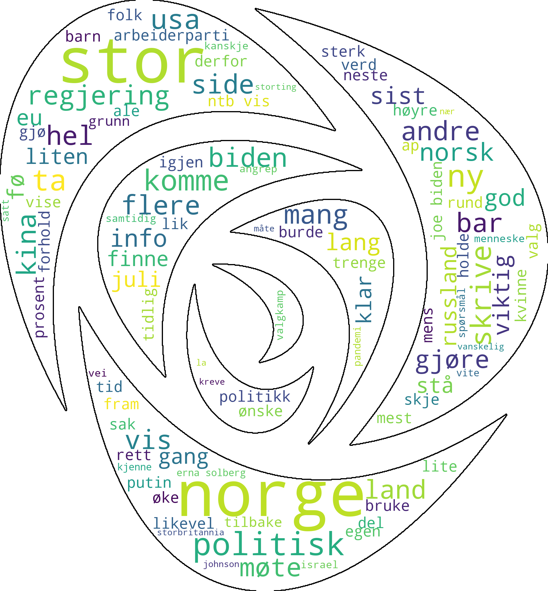
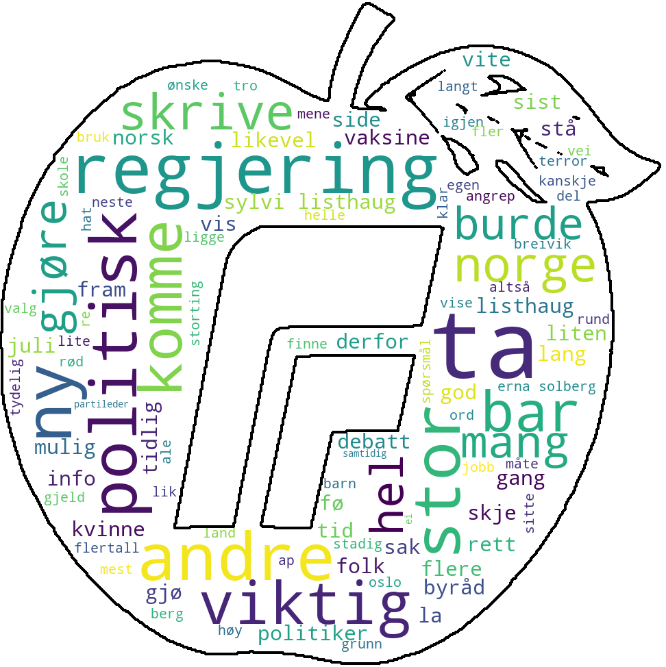
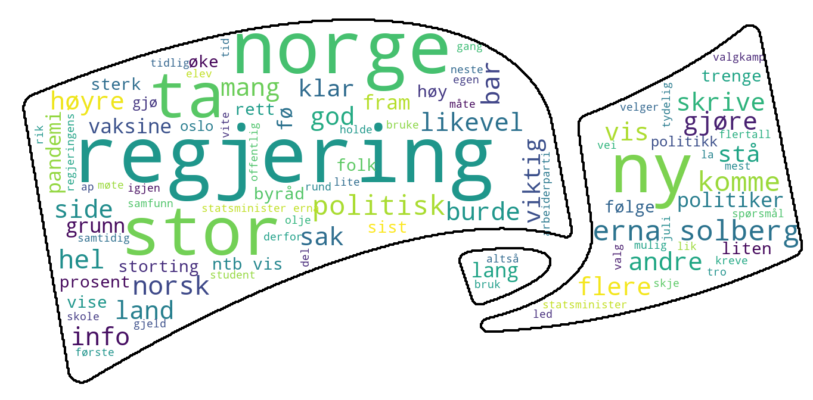
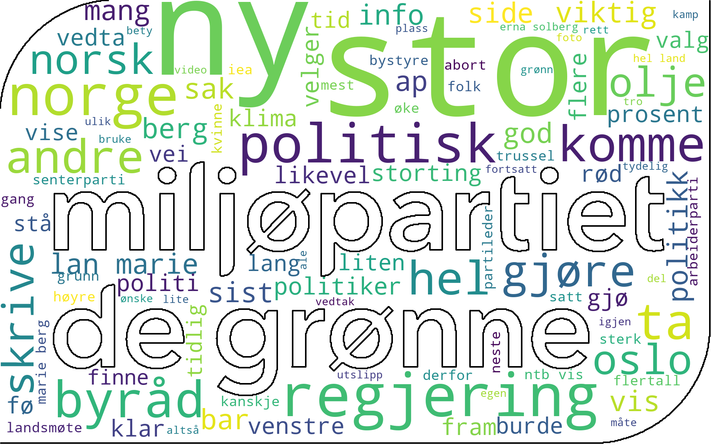
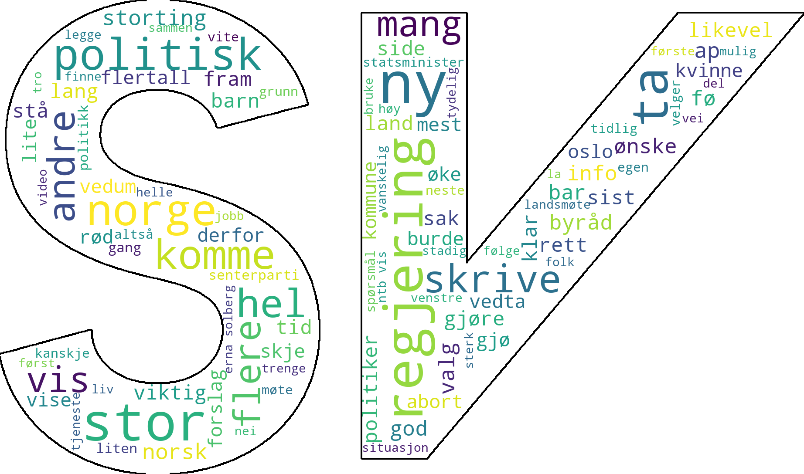

# PartiEksponering

## What and why
PartiEksponering is a hobby data analytics project of mine. With the parliamentary election in Norway comming up in 2021 I was curious in analyzing news-content related to
the different political parties. I wanted to see if I could detect some kind of statistical differences between articles concerning different parties. A small presentation
the analysis performed July 25th is presented [below](##Analysis).

The data source for the analysis is articles from the norwegian newspaper [Dagbladet](https://www.dagbladet.no). Dagbladet was selected due to the ease webscraping from it
compared to many other norwegian newspapers. Other popular newspages, for example [Aftenposten](https://www.aftenposten.no), required the user-agent to log-in with an
account, press GDPR-related popups or other actions which would complicate the webscraping.

### Features implemented
Below some of the features of the codebase is listed. Though a cleanup/refactoring of parts of the code could be beneficial, but will probably not be done. __Warning: Messy and in many cases unoptimized code__
- Async webscraping including javascript-rendering
  - Includes support for executing requests in batches at a time etc
- Database storage (with SQLite) of article-data in order to not request same URL multiple times
- Filtering out irrelevant articles based on age, url and content
- Some rudimentary Natural Language Processing regarding lemmatization and stopwords
- Some simple algorithms for categorizing articles for which political parties is relevant
- Bar-plotting the most popular words in articles, grouped by political parties
- Bar-plotting the words where the frequence of the word is higly relative to which political parties the article concerns
- Generating wordclouds of most frequent words used in the articles regarding each political party

## Sources used
For the lemmatization of words [Norsk ordbank – bokmål](https://www.nb.no/sprakbanken/ressurskatalog/oai-nb-no-sbr-5/) was used.
'Valglister' from [Valgdirektoratet](https://www.valg.no/om-valg/valgene-i-norge/valgdata-og-historikk/valglister-og-kandidater/) was also used.
Both the ordbank and valgliste can be downloaded using the provided [python script](src/Database/sources/download_sources.py).
Some of the stopwords used was retrieved from
[toppnorsk.com](https://toppnorsk.com/2018/02/17/50-preposisjoner/) and [ranks.nl](https://www.ranks.nl/stopwords/norwegian).

## Analysis
The script used to create these plots is [here](analysis/party_analysis.py). The `DBAnalyzer`-object attempted to scrape 500 articles from Dagbladet where the
URL contained "/meninger/". Articles on Dagbladet is following the format `www.dagbladet.no/X/...` where __X__ signals a type of article. Articles on the form
www.dagbladet.no/meninger/ signals opinion-pieces which should more often concern politics.

Note that the analyzer stopped collecting webpages before reaching 500. It stopped when it had to start searching for articles older than 100 days. Articles older
than this are problematic because for such old "/mening/"-articles Dagbladet.no requires a form of log-in it seems.

After attempting to categorize the found articles it presents the following bar plot. Note that uncategorized articles are discarded from this plot

Commentating on the bar plot requires some degree knowledge of the different parties and their politics. However I will mention that many the distribution
of the bars often make sense. Note for example that the word "22" here probably often has referred to the terror-attack July 22nd 2011 which had its 10th
anniversary 3 days before this data was collected. Seeing the bars of "FRP" (Fremskritspartiet) and "A" (Arbeiderpartiet) reach the highest will probably
not be surprising for a norwegian that has followed the news-cycle.

Below follows some wordcloud-figures for the most frequent words for the articles for each political party masked in their own logo. (Or in some cases where their
current logo was not suitable as a mask, variants/old versions of their logo)

#### Arbeiderpartiet
<dl>

</dl>

#### Fremskrittspartiet
<dl>

</dl>

#### Høyre
<dl>

</dl>

#### Kristelig Folkeparti
<dl>

</dl>

#### Miljøpartiet De Grønne
<dl>

</dl>

#### Senterpartiet
<dl>

</dl>

#### Sosialistisk Venstreparti
<dl>

</dl>

#### Venstre
<dl>

</dl>
